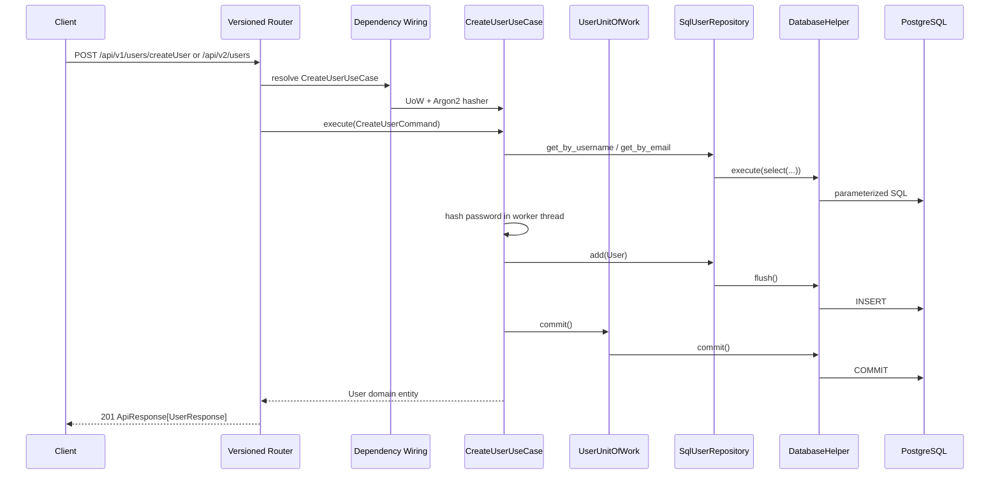
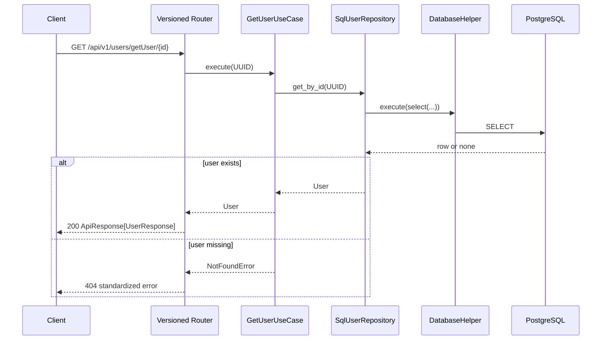

# AML Backend Architecture and Code Guide

This document explains how the current classes collaborate, where responsibilities
belong, and how an HTTP request moves through the system. The application uses
Clean Architecture: outer technical layers depend on inner business layers, while
the domain remains independent of FastAPI and SQLAlchemy.

## 1. Architecture at a glance

```text
HTTP client
    |
    v
FastAPI router and Pydantic schemas              app/api/
    |
    v
Application use case and interface contracts     app/application/
    |
    v
Domain entity                                    app/domain/
    ^
    |
SQLAlchemy repository and database adapters      app/infrastructure/
```

The allowed dependency direction is:

```text
API -------------> Application -------------> Domain
                         ^
                         |
Infrastructure ---------+
```

- The **domain** represents business data and rules.
- The **application layer** coordinates a business operation and defines the
  interfaces it needs.
- **Infrastructure** implements those interfaces with PostgreSQL, SQLAlchemy,
  and Argon2.
- The **API layer** converts HTTP input into application commands and converts
  domain results into HTTP responses.
- **Core** contains cross-cutting configuration, logging, middleware, and error
  translation.

## 2. Application startup and shutdown

### `app.main`

`main.py` is the composition root. It is the only place that creates the FastAPI
application and registers global infrastructure.

At module import:

1. `get_settings()` loads the selected environment configuration.
2. `configure_logging(settings)` configures ECS JSON logging.
3. FastAPI is created with the `lifespan` function.
4. request logging and security middleware are registered.
5. exception handlers are registered.
6. the v1 and v2 aggregate routers are included.

During lifespan startup, `configure_database(settings)` constructs the async
engine and session factory. During shutdown, `dispose_database()` closes the
connection pool.

The `/health` endpoint reports that the application process is available. It does
not currently execute a database query.

## 3. Configuration classes

### `Settings` — `app/core/config/settings.py`

`Settings` is the typed source of runtime configuration. Pydantic Settings reads
values from process environment variables and then from the selected
`environment/.env.<APP_ENV>` file.

Database inputs are separate fields: host, port, name, user, and password. The
read-only `database_url` property URL-encodes the username, password, and database
name and constructs a `postgresql+asyncpg` URL. `db_password` is a `SecretStr`, so
normal representations mask it.

`get_settings()` is cached. All callers within one process receive the same
validated settings instance.

### `ApiErrorCode` — `app/core/config/app_constant.py`

`ApiErrorCode` is a `StrEnum` containing stable public error codes such as
`NOT_FOUND`, `CONFLICT`, and `INTERNAL_SERVER_ERROR`. API clients should depend on
these codes rather than parsing human-readable messages.

## 4. API versioning and routing

```text
app/api/
|-- dependencies.py                 shared dependency wiring
|-- helpers/                        shared response builders
|-- schemas/                        shared response envelope
|-- v1/
|   |-- router.py                   /api/v1 aggregate router
|   |-- routers/user_router.py
|   `-- schemas/user_schema.py
`-- v2/
    |-- router.py                   /api/v2 aggregate router
    |-- routers/user_router.py
    `-- schemas/user_schema.py
```

Both versions currently implement the same behavior:

```http
POST /api/v1/users/createUser
GET  /api/v1/users/getUser/{user_id}
POST /api/v2/users
GET  /api/v2/users/{user_id}
```

Their routers and schemas are separate so v2 can introduce a breaking HTTP
contract without changing v1. Both versions intentionally share the same use
cases, domain entities, repositories, and database table.

### `CreateUserRequest`

Each version defines its own `CreateUserRequest` Pydantic model. It:

- validates username length and allowed characters;
- validates and normalizes the email format;
- requires an 8–128 character password;
- limits optional names to the DDL column lengths; and
- forbids unexpected fields.

The public request does not accept a role. Public creation always uses the safe
`user` default and cannot create an administrator by supplying extra JSON.

### `UserResponse`

Each version defines its own `UserResponse`. It contains public user fields and
deliberately excludes `password_hash`. `from_attributes=True` allows validation
from a domain `User` object.

### v1 and v2 `user_router`

The router functions have presentation-only responsibilities:

1. FastAPI validates the request or UUID path parameter.
2. `Depends(...)` supplies the relevant use case.
3. The router builds a `CreateUserCommand` or passes the UUID.
4. It awaits the use case.
5. It converts the returned domain entity to `UserResponse`.
6. `success_response()` creates the standard JSON envelope.

Routers do not hash passwords, execute SQL, commit transactions, or implement
duplicate-user rules.

## 5. Dependency injection

### `app.api.dependencies`

This module connects abstract application requirements to concrete
infrastructure.

`get_create_user_use_case()` receives an `AsyncSession` from `get_session()`, then
constructs:

```text
CreateUserUseCase
|-- SqlAlchemyUserUnitOfWork
|   `-- SqlUserRepository
`-- Argon2PasswordHasher
```

`get_get_user_use_case()` constructs `GetUserUseCase` with a
`SqlUserRepository` backed by the request's session.

The Argon2 hasher instance is reusable because it holds configuration, not
request-specific mutable state. The database session is request-scoped.

## 6. Shared API response classes

### `PaginationMeta`

Describes page number, page size, total records, and total pages. Numeric bounds
prevent invalid pagination metadata.

### `ResponseMeta`

Contains the effective request ID and optional pagination data.

### `ApiError`

Contains a stable error code and a list of safe details.

### `ApiResponse[T]`

Defines the standard response envelope:

```json
{
  "success": true,
  "message": "Operation completed successfully",
  "data": {},
  "error": null,
  "meta": {"request_id": "..."}
}
```

`success_response()` and `error_response()` build this envelope, encode Pydantic
and domain-compatible values, and copy the request ID into the response header.

## 7. Application classes

### `CreateUserCommand` — `app/application/use_cases/create_user.py`

This immutable dataclass is the application-layer input for user creation. It is
not an HTTP schema, so the use case can also be called by a job, CLI, or another
adapter.

### `CreateUserUseCase`

`execute()` performs the complete create-user workflow:

1. trims the username and lowercases the email;
2. checks username uniqueness through `UserRepository`;
3. checks email uniqueness through `UserRepository`;
4. hashes the password using the `PasswordHasher` contract;
5. constructs a domain `User` with safe defaults;
6. adds it through the repository;
7. commits through `UserUnitOfWork`; and
8. emits a sanitized `user.create` success event.

Argon2 hashing runs through `asyncio.to_thread()` because password hashing is
CPU-intensive and must not block FastAPI's event loop.

Pre-checks provide friendly conflict messages. The database unique constraints
remain the final protection against concurrent duplicate requests.

### `GetUserUseCase`

`execute(user_id)` asks the repository for a domain user. If no user exists, it
raises `NotFoundError`; otherwise it returns the entity. It has no knowledge of
HTTP status codes or SQLAlchemy.

## 8. Application interfaces

Interfaces are Python `Protocol` classes. Infrastructure classes satisfy them by
implementing the required methods; explicit inheritance is not required.

### `PasswordHasher`

Declares `hash(password) -> str`. The use case depends on this interface rather
than Argon2 directly, which makes the workflow easy to test with a fake hasher.

### `UserRepository`

Declares user persistence operations:

- `get_by_id()`
- `get_by_username()`
- `get_by_email()`
- `add()`

The contract uses domain `User` objects and UUIDs. It does not expose SQLAlchemy
models or result objects.

### `UserUnitOfWork`

Exposes a `users` repository and `commit()`. It defines the transaction boundary
needed by the create workflow. Repositories flush changes but do not independently
commit them.

## 9. Domain class

### `User` — `app/domain/entities/user.py`

`User` is an immutable, slotted dataclass representing the business entity. It
contains no FastAPI, Pydantic, or SQLAlchemy imports.

The entity currently stores the same core data as `sm_user_t`, including
`password_hash`. Presentation schemas control which fields leave the application;
the hash is never present in `UserResponse`.

As business rules grow, invariant behavior should be added to the domain layer
rather than to routers or ORM models.

## 10. Infrastructure persistence classes

### `Base` — `app/infrastructure/database/base.py`

`Base` is the shared SQLAlchemy `DeclarativeBase`. Its `MetaData` uses stable
naming conventions for indexes and constraints, which lets Alembic generate
predictable migration names.

### `UserModel` — `app/infrastructure/database/models/user_model.py`

`UserModel` maps the `sm_user_t` PostgreSQL table. It defines the UUID primary
key, unique username/email fields, password hash, names, flags, role, timestamps,
and the two requested indexes.

This class represents persistence shape, not the public API or the domain rules.

### `DatabaseHelper` — `app/infrastructure/database/database_helper.py`

`DatabaseHelper` wraps one injected `AsyncSession` and centralizes low-level
database execution and telemetry.

| Method | Behavior | Transaction effect |
| --- | --- | --- |
| `execute()` | Executes a SQLAlchemy ORM/Core statement | no commit |
| `execute_raw()` | Converts parameterized SQL text with `text()` and executes it | no commit |
| `flush()` | Sends pending ORM changes to PostgreSQL | no commit |
| `commit()` | Commits the current transaction | commit |
| `rollback()` | Rolls back the current transaction | rollback |
| `transaction()` | Async context manager around `session.begin()` | commit on success, rollback on failure |

Raw SQL must use named bound parameters:

```python
result = await helper.execute_raw(
    "SELECT id FROM sm_user_t WHERE email = :email",
    {"email": email},
)
```

Never construct raw SQL using f-strings or string concatenation.

Each operation records action, duration, outcome, and safe exception type. SQL
text, parameter values, connection URLs, passwords, and entity values are not
logged.

Use either explicit `commit()` through a Unit of Work or `transaction()` for one
workflow. Do not enter `transaction()` after the same session has already
auto-started a transaction through a query.

### `SqlUserRepository`

This is the PostgreSQL implementation of `UserRepository`.

- Read methods construct SQLAlchemy `select()` statements and execute them through
  `DatabaseHelper`.
- `_to_domain()` maps `UserModel` to the domain `User` entity.
- `add()` maps the domain entity to `UserModel`, adds it to the session, and
  flushes through `DatabaseHelper`.
- `IntegrityError` from a uniqueness race is translated into the safe application
  exception `UserAlreadyExistsError`.
- It never commits; the Unit of Work owns that decision.

### `SqlAlchemyUserUnitOfWork`

This adapter owns the concrete user repository for one session. Its `commit()`
method delegates to `DatabaseHelper.commit()`, ensuring transaction telemetry is
consistent.

### `Argon2PasswordHasher`

This class implements the application `PasswordHasher` protocol using
`PasswordHash.recommended()` from `pwdlib`. The generated encoded hash contains
the salt and algorithm parameters required for future verification. Plaintext
passwords are never persisted.

## 11. Database session lifecycle

### `configure_database(settings)`

Lazily creates one process-wide async engine and session factory. Important
settings include:

- `pool_pre_ping=True` to detect stale pooled connections;
- `echo=False` to prevent SQL and values from reaching logs;
- `expire_on_commit=False` so returned objects remain readable after commit; and
- `autoflush=False` so repositories control when writes are flushed.

### `get_session()`

This FastAPI dependency creates one `AsyncSession` per request. It yields the
session, rolls it back when downstream code raises, logs safe timing/outcome data,
and always closes it.

It does not automatically commit. The use case and Unit of Work decide when a
business operation is complete.

### `dispose_database()`

Clears the global engine/session-factory references and disposes the connection
pool. Repeated calls are safe.

## 12. Logging and middleware classes

### `ServiceContextFilter`

Adds ECS `service.name`, `service.environment`, and a default event dataset to log
records that do not already provide them.

### `configure_logging(settings)`

Configures one ECS JSON console handler for application and Uvicorn logs. Uvicorn
access logs are disabled because their default message can include raw query
strings; `RequestLoggingMiddleware` replaces them.

### `RequestLoggingMiddleware`

For every request it:

1. accepts a valid `X-Request-ID` or generates a UUID;
2. stores it on `request.state`;
3. times the request;
4. adds the ID to the response header; and
5. logs method, path, status, duration, outcome, and client address.

It deliberately excludes request bodies, response bodies, headers, and query
values. Unhandled exceptions are logged once and converted to the safe standard
error response.

### `SecurityHeadersMiddleware`

Adds configured security headers such as `X-Content-Type-Options`, frame policy,
referrer policy, permissions policy, CSP, and optional HSTS. Documentation routes
are handled specially so Swagger UI and ReDoc can load correctly.

## 13. Exception classes and handlers

### Application exception hierarchy

```text
ApplicationError
|-- AuthenticationError
|-- AuthorizationError
|-- NotFoundError
`-- ConflictError
    `-- UserAlreadyExistsError
```

`ApplicationError` contains a safe message, stable code, and optional safe
details. These errors may be exposed to API clients.

Exception handlers translate:

- Pydantic validation failures to HTTP 422 without echoing invalid input values;
- framework HTTP exceptions to matching HTTP statuses;
- application exceptions to their configured statuses and codes; and
- unexpected exceptions to a sanitized HTTP 500 response.

Unexpected internal exception details are logged for operators but are never
returned to clients.

## 14. End-to-end request flows

### Create user



### Get user



## 15. Adding another feature

For a new resource such as an AML case:

1. add a pure domain entity under `app/domain/entities/`;
2. define repository/Unit of Work protocols under `app/application/interfaces/`;
3. add focused use cases under `app/application/use_cases/`;
4. add the SQLAlchemy model under `app/infrastructure/database/models/`;
5. implement the repository under `app/infrastructure/repositories/` using
   `DatabaseHelper`;
6. wire concrete dependencies in `app/api/dependencies.py`;
7. add separate v1/v2 schemas and routers only where each HTTP version needs the
   endpoint; and
8. test domain/application behavior with fakes and API behavior with FastAPI
   dependency overrides.

Keep these boundaries:

- no FastAPI or SQLAlchemy imports in domain classes;
- no HTTP schemas in use cases;
- no SQL in routers;
- no commits inside individual repositories;
- no plaintext passwords or sensitive AML data in logs; and
- no password hashes in API response schemas.
